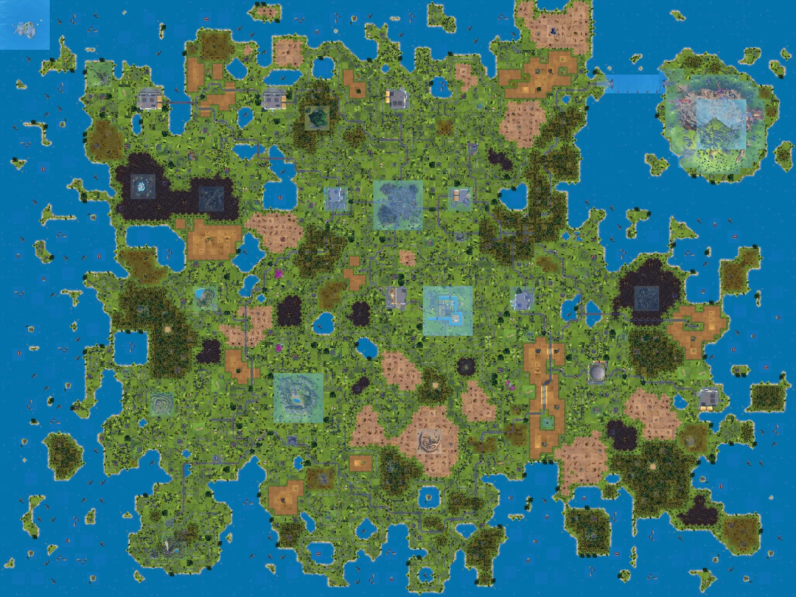

# Scrap Mechanic Chapter 2 Map Generator

Generate and explore a complete Chapter 2 world map from a seed or local
Scrap Mechanic save—entirely in your browser.

**Live site:** https://sm.kornplays.com

**Source code:** https://github.com/KornPlays/sm_map_generator



## Features

- Generates a world map from a seed or `.db` save.
- Interactive viewer with coordinates, markers, quest rewards, and offline map caching.
- Intelligently loads tile detail up to 200 × 200 pixels per tile while you zoom.
- Exports the map as an image or as a standalone interactive HTML viewer.
- Runs locally in the browser without uploading saves or maps.

## Host the map viewer

Generate or upload a map, open **Download HTML**, and choose one of the two
exports:

- **Original asset source** downloads one HTML file. Upload it as `index.html`.
- **Local asset source** downloads a ZIP. Extract it and upload all of its
  contents together if you want to host every required asset yourself.

Both exports contain the interactive map viewer; they do not include the map
generator.

---

## Run the map generator locally

Requires Node.js 20.19 or newer.

```bash
git clone https://github.com/KornPlays/sm_map_generator.git
cd sm_map_generator
npm ci
npm run dev
```

## Host the map generator

[](https://vercel.com/new/clone?repository-url=https://github.com/KornPlays/sm_map_generator)
[](https://app.netlify.com/start/deploy?repository=https://github.com/KornPlays/sm_map_generator)
[](https://dash.cloudflare.com/?to=%2F%3Aaccount%2Fworkers-and-pages)
[](https://github.com/KornPlays/sm_map_generator/fork)

For a manual deployment:

```bash
npm ci
npm run build
```

Host the contents of `dist/`, serve `index.html` at the root, and preserve the
other generated folders. For Cloudflare Pages, use `npm run build` and `dist`.

Generator internals and the golden-seed update process are documented in
[docs/world-generator.md](docs/world-generator.md).

## License

The original project code and project-created interface artwork are licensed
under the [MIT License](LICENSE). Copies and substantial portions must retain
the copyright and permission notice.

Copyright © 2026 KornPlays.

This is an unofficial fan project and is not affiliated with or endorsed by
Axolot Games. Scrap Mechanic, its name, trademarks, and underlying game content
belong to their respective owners. See [third-party notices](THIRD_PARTY_NOTICES.md).
